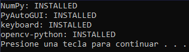
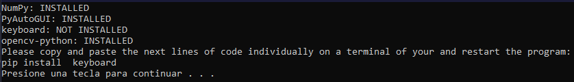
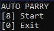
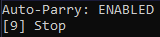
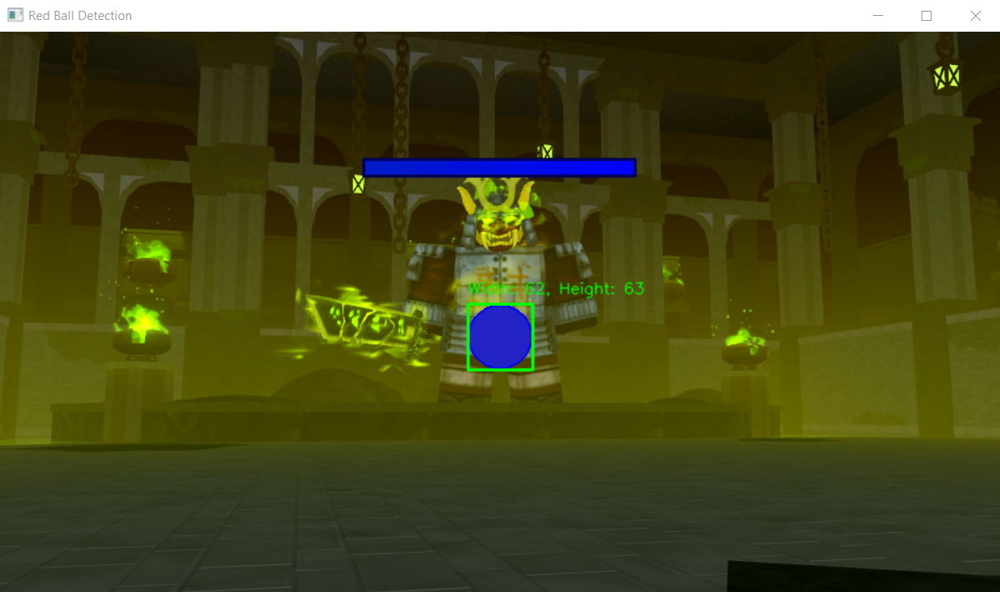

# Auto-Parry (EN/SP)

> (EN) This script is capable to automatically parry balls in a Roblox's game called Death Ball. (SP) Este script tiene la capacidad de haces parry a las bolas en el juego de Roblox llamado Death Ball.

## ENGLISH
### WARNING!
1. This program can gain a notable advantage in the game and may be a reason for banning. **USE IT WITH CAUTION!**
2. This program was made in the Windows Operating System and has not been tested (yet) with other Operating Systems.
3. The program requires having some Python libraries installed for its operation. The same program will help you tell them which libraries they are missing and how to install them. It is recommended to use tools such as YouTube to learn its correct installation.
4. This program is **NOT** **100% accurate**, it tends to have errors in detecting the ball at higher speeds and when nearby objects or entities with a similar color are found.
### Functioning
* Running the `program.py` file will check the installation of the libraries. Those that are installed will appear as **INSTALLED** and those that are not as **NOT INSTALLED**:

* If you have libraries in **NOT INSTALLED** status, the program will indicate the code(s) that you will have to copy and paste into the terminal:

* Once you have all the dependencies installed, press any key to continue and the main menu will appear:

* In this menu, you will have the options to enable auto parry or close the program by pressing the keys indicated there.
* If you select **Start**, the auto parry will start working and a new window will open showing how the program interprets the ball:

* In case you select **Stop**, the auto parry will stop and the new window will close, but the program will continue running.
* For greater convenience, the program will indicate when auto parry is enabled or not with the messages **ENABLE/DISABLED**.

## SPANISH
### ¡ADVERTENCIA!
1. Este programa puede sacar una ventaja notable dentro del juego y puede ser motivo de ban. **¡ÚSELO CON PRECAUCIÓN!**
2. Este programa se realizó en el Sistema Operativo Windows y no se han hecho pruebas (aún) con otros Sistemas Operativos.
3. El programa requiere de tener unas librerías de Python instaladas para su funcionamiento. El mismo programa les ayudará a indicarles qué librerías les faltan y cómo instalarlas. Se recomienda hacer uso de herramientas como Youtube para aprender su correcta instalación.
4. Este programa **NO** es **100% preciso**, tiende a tener fallos en la detección de la bola a mayores velocidades y cuando se encuentren objetos o entidades cercanas con un color parecido.
### Funcionamiento
* Al ejecutar el archivo `program.py` se comprobará la instalación de las librerías. Las que se encuentren instaladas, aparecerán como **INSTALLED** y las que no como **NOT INSTALLED**:

* En caso tal de que tenga librerías en estado **NO INSTALLED** el programa le indicará el/los códigos que tendrá que copiar y pegar en la terminal:

* Una vez tenga todas las dependecias instaladas, presiona cualquier tecla para continuar y le aparecerá el menú principal:

* En este menú, tendrá las opciones de habilitar el auto parry o de cerrar el programa presionando las tecladas que se indican allí.
* En caso de que seleccione **Start**, el auto parry entrará en funcionamiento y se abrirá una nueva ventana que mostrará cómo interpreta el programa a la pelota:

* En caso de que seleccione **Stop**, el auto parry se detendrá y se cerrará la nueva ventana, pero el programa seguirá ejecutándose.
* Para mayor comodidad, el programa le indicará cuando el auto parry se encuentre habilitado o no con los mensajes **ENABLE/DISABLED**.
